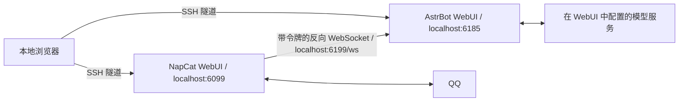

# QQ 聊天机器人：AstrBot + NapCat

使用 AstrBot 自带的 WebUI 配置模型、人格、插件和消息规则。NapCat 负责 QQ 扫码登录，并通过 OneBot v11 反向 WebSocket 接入 AstrBot。

- AstrBot **4.27.4**：复用 `astrbot-wsl` Conda 环境，由 systemd 用户服务托管。
- NapCat **v4.18.28**：Docker Compose 容器，使用 Linux 主机网络。
- 适用环境：启用 systemd 的 WSL2 Ubuntu、Ubuntu 22.04/24.04 服务器。支持镜像提供的 x86_64/arm64 架构。
- 前端使用上游自带页面，无需单独安装 Node.js 或构建前端。



## 本地启动

```bash
cd /home/duscwalk/toys/qqBots2.0
conda activate astrbot-wsl
./bot setup
./bot up
./bot credentials
```

`./bot` 也能自动寻找名为 `astrbot-wsl` 的环境。环境不存在时，`./bot setup` 会依据 `environment.yml` 创建它。第一次拉取 NapCat 镜像约需下载 600 MB。

| 用途 | 本地 URL |
| --- | --- |
| AstrBot 配置后台 | http://127.0.0.1:6185 |
| NapCat 登录后台 | http://127.0.0.1:6099/webui/ |

可以直接在 Windows 浏览器打开上述 WSL 地址。初始密码与令牌由程序随机生成，保存在 `runtime/credentials.json`（权限 600）。`./bot credentials` 会显示登录信息；不要把这个文件提交到 Git。AstrBot 用户名默认是 `astrbot`，首次登录按页面提示修改密码。

`setup` 可以重复运行，会保留 WebUI 中保存的配置、登录信息和密钥。日常启动使用 `./bot up` 即可。不要用 `sudo ./bot`。

## 完成 QQ 登录和模型配置

1. 打开 NapCat 后台，填入 `./bot credentials` 显示的 **NapCat WebUI Token**。用机器人 QQ 账号的手机 QQ 扫码，并确认登录。无需在项目文件里保存 QQ 密码。
2. NapCat 的 WebSocket 客户端已预设为 `ws://127.0.0.1:6199/ws`，令牌与 AstrBot 自动配对。登录账号后 NapCat 会从默认配置生成 `onebot11_<QQ号>.json`。在网络配置中确认名为 `astrbot` 的客户端已启用。
3. 打开 AstrBot 后台，检查 ID 为 `napcat` 的 OneBot v11 机器人是否已连接。
4. 在模型提供商页面添加服务商、API Base、API Key 和聊天模型，并在当前配置中选择默认聊天模型。这些信息都通过 WebUI 保存；本项目没有预填模型密钥。
5. 在配置中添加你自己的 **管理员 QQ 号**（与机器人账号区分），设置人格和需要的插件。默认支持好友私聊，群聊通过 `@机器人` 或 `/` 前缀唤醒；默认未启用会话白名单，需要时在配置中开启。
6. 用另一个 QQ 账号发 `/help` 验证基本连接，再私聊一句话验证模型回复。群聊可以发送 `@机器人 你好`。这些真实消息测试需要你登录并配置模型后操作。

图片等 AstrBot 生成的媒体目录 `data/` 在主机与容器内使用相同的绝对路径。NapCat 下发的 `/app/.config/QQ` 文件路径也预设了映射，指向本项目的 `runtime/napcat/qq`。迁移目录后重新运行 `setup` 会更新本项目生成的这条映射。

## 蕾缪安人格与知识库

原作资料与人格核心见 [知识库目录](knowledge/lemuen/README.md)，接入与维护见 [蕾缪安说明](docs/lemuen.md)。当前已在 njuse 启用全部 QQ 私聊，群聊沿用原配置。普通 CI 执行离线校验、测试和打包，不调用收费 API。私聊的消息合并、图片理解、长期记忆与低频主动聊天见 [插件配置](docs/plugins.md)。

## 日常管理

```bash
./bot up                     # 启动，并启用 AstrBot 开机启动
./bot status                 # 查看 systemd、容器和页面状态
./bot check                  # 检查页面、监听配置、OneBot URL 和令牌是否配对
./bot logs astrbot           # 最近的 AstrBot 日志
./bot logs napcat            # 最近的 NapCat 日志（可能包含登录二维码和令牌）
./bot logs astrbot --follow  # 持续查看日志
./bot restart                # 重启两个组件
./bot down                   # 停止并停用服务，保留全部数据
./bot compose ps             # 其他 Docker Compose 命令
```

`./bot check` 成功只代表后台可访问、连接配置一致；QQ 是否在线、API Key 是否有效以及模型是否能回复，需要在页面和真实聊天中确认。修改端口时需同步修改 `compose.yaml` 中的健康检查和 SSH 隧道目标端口。

AstrBot 服务文件由启动脚本生成在 `~/.config/systemd/user/qqbots2-astrbot.service`，使用当前普通用户和当前 Conda 环境。服务日志进入 journal；NapCat 容器日志设置了大小和份数上限。NapCat 自身日志及媒体文件仍需按需清理。

## 部署到 Ubuntu 服务器

当前 `njuse` 的部署与访问方式见 [njuse 部署记录](docs/njuse.md)。以下步骤用于准备新服务器，示例普通用户为 `duscwalk`，按实际用户名替换。

### 1. 安装系统依赖

以服务器上的普通用户登录后执行：

```bash
sudo apt update
sudo apt install -y docker.io docker-compose-v2 dbus-user-session git curl ca-certificates rsync ffmpeg
sudo systemctl enable --now docker
sudo usermod -aG docker "$(id -un)"
sudo loginctl enable-linger "$(id -un)"
```

断开 SSH 并重新登录，让 Docker 用户组生效。`enable-linger` 让用户服务在退出 SSH 后继续运行，并在系统启动时启动。服务器网络规则只需允许 SSH；无需开放 6185、6099、6199 端口。

没有 Conda 时，可以安装 Miniforge（已安装 Conda 的服务器跳过）：

```bash
curl -fL "https://github.com/conda-forge/miniforge/releases/latest/download/Miniforge3-Linux-$(uname -m).sh" -o /tmp/qqbot-miniforge.sh
bash /tmp/qqbot-miniforge.sh -b -p "$HOME/miniforge3"
```

### 2. 传输项目和配置

在本地 WSL 中执行。先停止本地实例，再迁移 SQLite 数据库和 QQ 登录状态：

```bash
cd /home/duscwalk/toys/qqBots2.0
./bot down
rsync -a --exclude='.git/' --exclude='__pycache__/' --exclude='runtime/manage.lock' --exclude='astrbot.lock' ./ duscwalk@服务器地址:~/qqBots2.0/
```

在服务器中启动：

```bash
cd ~/qqBots2.0
./bot setup
./bot up
./bot credentials
# 首次启动稍等片刻
./bot check
```

`setup` 会在服务器生成 `astrbot-wsl` 环境，`up` 会根据服务器上的实际路径重新生成服务文件和媒体挂载。更换机器后，QQ 可能需要重新扫码。请让同一机器人账号只在目标实例上运行。

全新部署只需传输代码，然后运行同样的命令；迁移已有模型配置、人格、插件和会话记录时需要同时传输 `data/`、`runtime/` 和 `.astrbot`。历史消息里存储的旧绝对文件路径不会批量改写。

### 3. 从本地浏览器访问服务器后台

在本地 WSL 中运行：

```bash
./scripts/tunnel.sh duscwalk@服务器地址
# 自定义 SSH 端口示例：
# ./scripts/tunnel.sh duscwalk@服务器地址 -p 2222
```

保持隧道终端打开，然后访问：

- AstrBot：http://127.0.0.1:16185
- NapCat：http://127.0.0.1:16099/webui/

使用不同的本地端口，便于和本地开发实例区分。也可以在 Windows PowerShell 中直接运行：

```powershell
ssh -N -T -o ExitOnForwardFailure=yes -o ServerAliveInterval=30 -L 127.0.0.1:16185:127.0.0.1:6185 -L 127.0.0.1:16099:127.0.0.1:6099 duscwalk@服务器地址
```

关闭 SSH 隧道只会关闭浏览器到服务器的连接，机器人会继续在服务器运行。

## 目录与备份

| 路径 | 内容 |
| --- | --- |
| `bot`、`scripts/manage.py` | 初始化、启动、状态及检查命令 |
| `compose.yaml` | NapCat 部署和持久化挂载 |
| `environment.yml`、`requirements.txt` | Conda 环境与 AstrBot 版本 |
| `data/cmd_config.json` | AstrBot 配置，包含模型 API Key |
| `data/` | 数据库、插件、人格、会话和媒体 |
| `runtime/credentials.json` | 初始后台密码和组件令牌 |
| `runtime/napcat/config/` | NapCat 配置 |
| `runtime/napcat/qq/` | QQ 登录状态和缓存 |
| `runtime/napcat/plugins/` | NapCat 插件 |

备份前停止服务，以保持数据库和登录状态一致。备份文件包含私密信息，保存在自己的受控目录：

```bash
./bot down
tar -czf "$HOME/qqbots2-backup-$(date +%Y%m%d-%H%M%S).tar.gz" data runtime .astrbot
./bot up
```

升级前备份；AstrBot 版本在 `requirements.txt` 和 `scripts/manage.py` 中固定，NapCat 版本在 `compose.yaml` 中固定。更改版本后运行 `./bot setup`、`./bot compose pull`、`./bot up`，再重启 AstrBot 并检查兼容性。

## GitHub CI/CD

仓库：[DuscWalk/Chatbot](https://github.com/DuscWalk/Chatbot)。工作流位于 `.github/workflows/ci-cd.yml`，当前部署方式见 [njuse 说明](docs/njuse.md)。

- 推送 main、向 main 提交 PR 或手动运行 Actions：在 GitHub 托管 runner 检查 Python、Shell、Compose、知识库和隔离插件测试。
- main 推送通过 CI 后，专用 `chatbot-njuse-deploy` runner 部署同一个提交；PR 不部署。runner 需完成 GitHub 注册。
- `AUTO_DEPLOY=false` 仓库变量可暂停自动部署；手动运行工作流并勾选 deploy 可单次部署。
- njuse runner 直接更新本机服务，不需要服务器 SSH Secrets。部署保留后台设置和 NapCat 登录，失败后恢复代码、数据和本次改变的依赖。

可选仓库变量：`DEPLOY_RUNNER_LABELS`（JSON 标签数组）、`DEPLOY_PATH`（默认 `/home/ubuntu/qqBots2.0`）、`DEPLOY_TRANSPORT`（local 或 ssh）。如果从本机 runner 中转，将 transport 设为 ssh、`DEPLOY_HOST` 设为 njuse；默认使用当前系统用户的 SSH 配置。仍支持显式的 `DEPLOY_USER`、`DEPLOY_PORT` 和部署专用 `DEPLOY_SSH_KEY`、`DEPLOY_KNOWN_HOSTS` Secrets。

只部署 Git 跟踪的代码。目标需已经完成 `./bot setup`、模型配置与 QQ 登录；自动部署不承担首次开户和账号登录。新机器初始化沿用前面的部署步骤。

本地执行 CI 的主要检查：

```bash
conda activate astrbot-wsl
python -m pip install -r requirements-dev.txt
ruff check scripts tests plugins
ruff format --check scripts tests plugins
shellcheck bot scripts/*.sh
python scripts/lemuen.py check
python scripts/lemuen.py build
python -m unittest discover -s tests -v
./bot compose config --quiet
```

## 排查问题

- **页面打不开**：运行 `./bot status` 和对应组件的 `./bot logs`。服务器端先确认页面可用，再检查 SSH 隧道是否仍在运行。
- **NapCat 已登录但 AstrBot 未连接**：运行 `./bot check`，核对账号专属配置中的 URL、令牌及客户端启用状态。修改默认 `onebot11.json` 不会覆盖已有的账号专属配置。
- **连接成功但没有回复**：确认默认聊天模型、API Key、会话白名单和唤醒规则。在 WebUI 日志中查看模型请求结果。
- **Docker 权限不足**：确认实际用户是开发用户，已加入 `docker` 组，并已重新登录。
- **`systemctl --user` 无法连接**：从普通用户的正常登录会话执行，确认 Ubuntu 的 systemd 正常运行；WSL 需要启用 systemd 后重启 WSL。
- **忘记 AstrBot 密码**：执行 `./bot down`，在本目录激活 `astrbot-wsl` 后运行 `astrbot password`，交互式设置新密码，再执行 `./bot up`。`credentials` 显示的是初始密码，不会跟随 WebUI 改密更新。
- **镜像下载失败**：Docker 守护进程不会自动继承终端代理。本次 WSL 已单独配置 `/etc/systemd/system/docker.service.d/qqbots2-proxy.conf`，使用本机已有的 `127.0.0.1:7897` 代理。服务器无需复制此文件；按服务器实际网络配置 Docker。

上游参考：[AstrBot](https://github.com/AstrBotDevs/AstrBot)、[AstrBot 文档](https://docs.astrbot.app/)、[NapCat-Docker](https://github.com/NapNeko/NapCat-Docker)、[NapCatQQ](https://github.com/NapNeko/NapCatQQ)。
